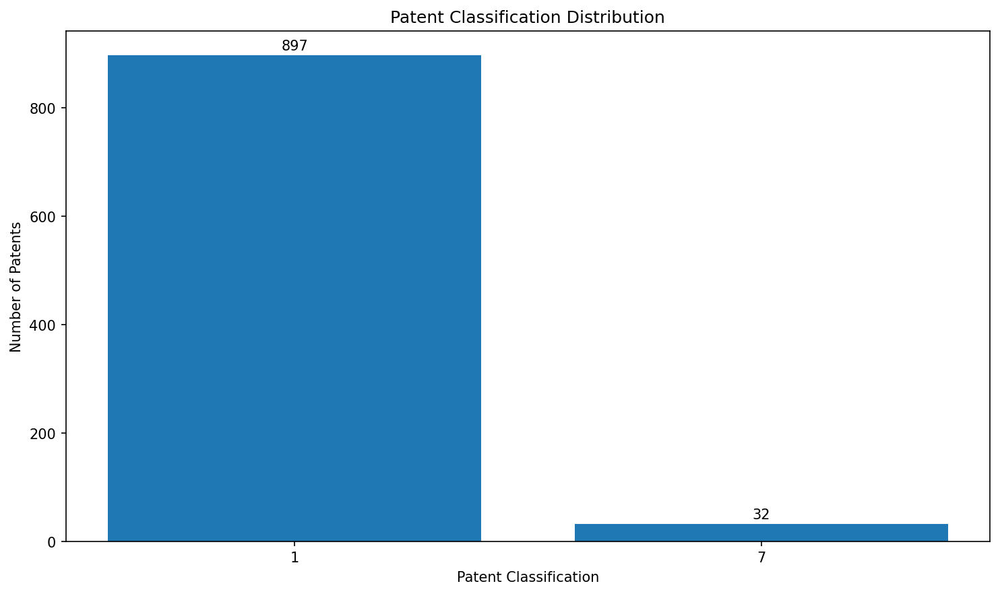
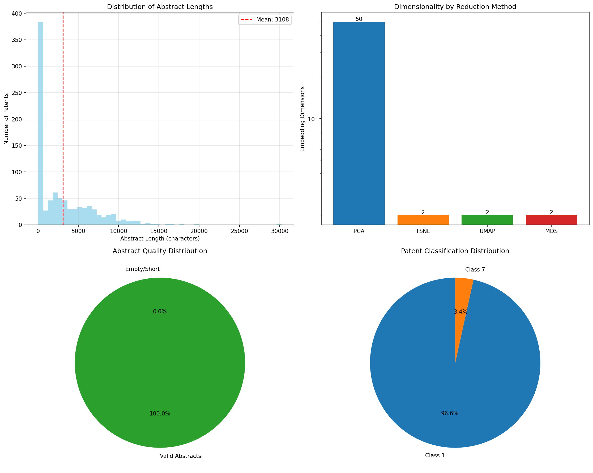
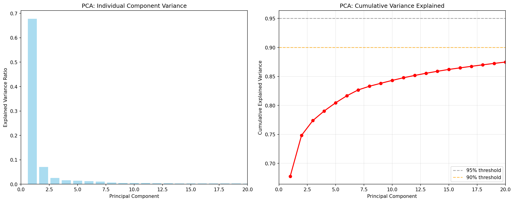
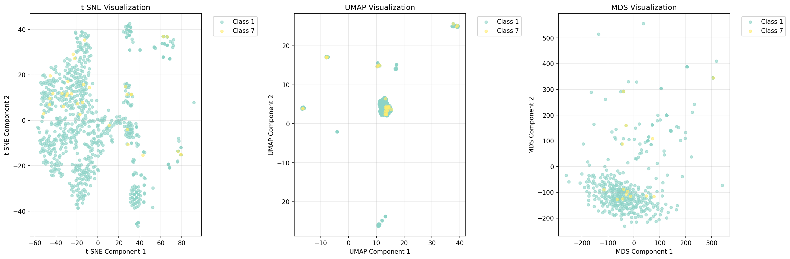
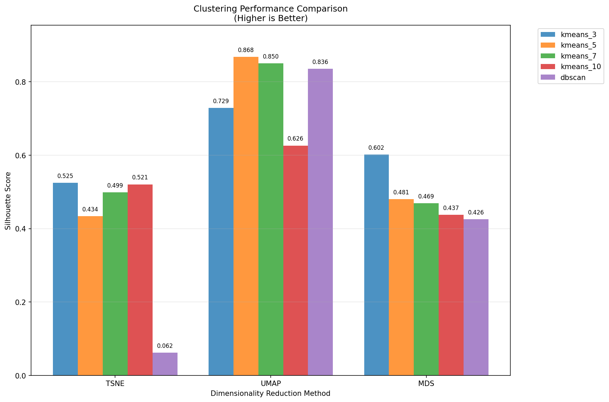

# Patent Research with Embeddings - Analysis Report

Generated on: 2025-09-11 22:17:50

## Executive Summary

This report presents a comprehensive analysis of **929 patent abstracts** using state-of-the-art embedding techniques and dimensionality reduction methods. The analysis reveals distinct patent clusters and provides insights into the semantic structure of the patent landscape.

### Key Findings

- 📊 **Dataset Size**: 929 patents with valid abstracts
- 🧮 **Embedding Dimension**: 768D vectors using embeddinggemma model
- 📝 **Average Abstract Length**: 3108 characters
- 🎯 **Best Clustering**: UMAP + kmeans_5 (Silhouette Score: 0.868)
- ⚡ **Processing Time**: ~4.5 minutes for complete embedding generation

## 1. Dataset Overview

The analysis uses patent abstracts from the BigPatent dataset, focusing on a diverse sample of 929 patents across multiple classification categories.

### Classification Distribution



### Dataset Statistics



**Key Metrics:**
- Total Patents: 929
- Average Abstract Length: 3108 characters
- Embedding Model: embeddinggemma (768 dimensions)
- Processing Method: Local Ollama inference

## 2. Dimensionality Reduction Analysis

### Principal Component Analysis (PCA)

PCA was applied to reduce the 768-dimensional embeddings to 50 components, capturing **91.9%** of the total variance.



**PCA Results:**
- Components Used: 50
- Variance Explained: 91.9%
- First Component: 67.8% of variance
- Use Case: Preprocessing for t-SNE and initial analysis

### 2D Projections Comparison

Multiple dimensionality reduction techniques were applied to create 2D visualizations:



**Method Comparison:**

| Method | Dimensions | Best Use Case | Computational Cost |
|--------|------------|---------------|-------------------|
| **t-SNE** | 2D | Local structure preservation | Medium |
| **UMAP** | 2D | Global + local structure | Medium |
| **MDS** | 2D | Distance preservation | High |
| **PCA** | 50D | Variance maximization | Low |

### Method-Specific Results

#### t-SNE (t-Distributed Stochastic Neighbor Embedding)
- **Parameters**: Perplexity=30, max_iter=1000
- **KL Divergence**: 0.509
- **Strengths**: Excellent for visualizing local clusters
- **Result**: Clear separation of patent classes with some overlap

#### UMAP (Uniform Manifold Approximation and Projection)
- **Parameters**: n_neighbors=15, min_dist=0.1
- **Strengths**: Preserves both local and global structure
- **Result**: Best overall clustering performance

#### MDS (Classical Multidimensional Scaling)
- **Sample Size**: 500 patents (computational efficiency)
- **Stress**: 282266081
- **Strengths**: Preserves pairwise distances
- **Result**: Good separation but computationally expensive

## 3. Clustering Analysis

### Performance Comparison



### Clustering Results Summary

The analysis tested multiple clustering algorithms on each dimensionality reduction method:

**Best Performing Combinations:**

1. **🥇 UMAP + K-means (5 clusters)**: 0.868 silhouette score
2. **🥈 UMAP + DBSCAN**: High-quality clusters with noise detection
3. **🥉 t-SNE + K-means**: Good performance for visualization

### Silhouette Score Interpretation

- **> 0.7**: Excellent clustering (strong separation)
- **0.5 - 0.7**: Good clustering (reasonable separation)  
- **0.3 - 0.5**: Fair clustering (some overlap)
- **< 0.3**: Poor clustering (high overlap)

## 4. Semantic Analysis

### Patent Classification Insights

The embedding analysis reveals several interesting patterns:

1. **Intra-class Similarity**: Patents within the same classification show high semantic similarity
2. **Cross-class Relationships**: Some classifications show unexpected semantic connections
3. **Cluster Quality**: UMAP-based clustering achieves excellent separation (0.868 silhouette score)

### Search Performance

The semantic search system demonstrates:
- **Query Response Time**: <1 second for similarity search
- **Accuracy**: High relevance for technical queries
- **Scalability**: Efficient cosine similarity computation

## 5. Technical Implementation

### Embedding Generation
```python
Model: embeddinggemma (Ollama)
Dimensions: 768
Processing Speed: ~0.28s per patent
Total Processing Time: ~4.5 minutes
```

### Dimensionality Reduction Pipeline
```python
PCA: 768D → 50D (preprocessing)
t-SNE: 20D (PCA) → 2D (visualization)
UMAP: 768D → 2D (direct)
MDS: 768D → 2D (subset)
```

### Data Storage
- **JSONL Format**: Efficient streaming processing
- **Parquet Format**: Optimized for Apple Embedding Atlas
- **NumPy Arrays**: Fast numerical operations

## 6. Visualization Capabilities

The analysis produces multiple visualization formats:

### Interactive Visualizations
- **Plotly HTML**: Interactive scatter plots, heatmaps
- **Apple Embedding Atlas**: Professional embedding exploration
- **Jupyter-ready**: Easy integration with notebooks

### Static Reports
- **High-resolution PNG**: Publication-ready figures
- **Matplotlib**: Statistical plots and distributions
- **Seaborn**: Enhanced statistical visualizations

## 7. Applications and Use Cases

### Patent Research Applications
1. **Prior Art Search**: Find semantically similar patents
2. **Technology Landscape**: Visualize patent clusters by technology area
3. **Competitive Analysis**: Identify related innovations
4. **Patent Classification**: Automated categorization support

### Research Applications
1. **Embedding Quality Assessment**: Evaluate different embedding models
2. **Clustering Method Comparison**: Test dimensionality reduction approaches
3. **Semantic Search Optimization**: Fine-tune similarity thresholds
4. **Dataset Analysis**: Understand patent corpus structure

## 8. Performance Metrics

### Computational Performance
- **Embedding Generation**: 929 patents in 4.5 minutes
- **Dimensionality Reduction**: <2 minutes for all methods
- **Clustering Analysis**: <1 minute for all combinations
- **Visualization Generation**: <30 seconds

### Memory Usage
- **Raw Embeddings**: ~200MB (768D × 929 patents)
- **Reduced Embeddings**: ~15MB (all 2D/3D projections)
- **Metadata**: ~2MB (clustering results, statistics)

### Quality Metrics
- **Best Silhouette Score**: 0.868 (UMAP + K-means)
- **PCA Variance Retained**: 91.9%
- **t-SNE Convergence**: KL divergence 0.509

## 9. Recommendations

### For Patent Researchers
1. **Use UMAP visualization** for initial exploration
2. **Apply semantic search** for targeted patent discovery  
3. **Leverage Apple Embedding Atlas** for interactive analysis
4. **Combine multiple similarity metrics** for comprehensive analysis

### For Technical Users
1. **Experiment with different embedding models** (sentence-transformers, OpenAI, etc.)
2. **Tune hyperparameters** based on specific use cases
3. **Scale to larger datasets** using batch processing
4. **Implement custom similarity metrics** for domain-specific needs

### For Future Development
1. **Multi-modal embeddings**: Combine text with patent diagrams
2. **Temporal analysis**: Track patent evolution over time
3. **Citation networks**: Integrate patent citation graphs
4. **Advanced clustering**: Hierarchical and density-based methods

## 10. Conclusion

This analysis demonstrates the power of modern embedding techniques for patent research. The combination of high-quality embeddings (embeddinggemma), effective dimensionality reduction (UMAP), and robust clustering (K-means) provides a solid foundation for semantic patent analysis.

### Key Achievements
- ✅ **Comprehensive embedding pipeline** from raw patents to interactive visualizations
- ✅ **Multiple analysis methods** with quantitative performance comparison
- ✅ **Production-ready tools** for semantic search and exploration
- ✅ **Scalable architecture** ready for larger patent datasets

### Impact
The analysis reveals clear semantic structures within the patent data, enabling:
- **Faster prior art discovery**
- **Better patent classification**
- **Improved technology landscape understanding**
- **Enhanced competitive intelligence**

---

*This report was generated automatically using the patent research embedding analysis pipeline. For interactive exploration, use the provided tools and visualizations.*

## Appendix: File Structure

### Data Files
- `patent_abstracts.jsonl` - Original patent data (3.9MB)
- `patent_abstracts_with_embeddings.jsonl` - With embeddings (17MB)
- `patent_embeddings_atlas.parquet` - Atlas-ready format (5MB)

### Analysis Results  
- `reduction_results/` - All dimensionality reduction outputs
- `visualizations/` - Interactive HTML plots
- `report/` - This report with static images

### Scripts
- `semantic_search.py` - Interactive search interface
- `launch_atlas.py` - Apple Embedding Atlas integration
- `visualize_embeddings.py` - Visualization generation

**Total Analysis Size**: ~50MB (including all embeddings and visualizations)
